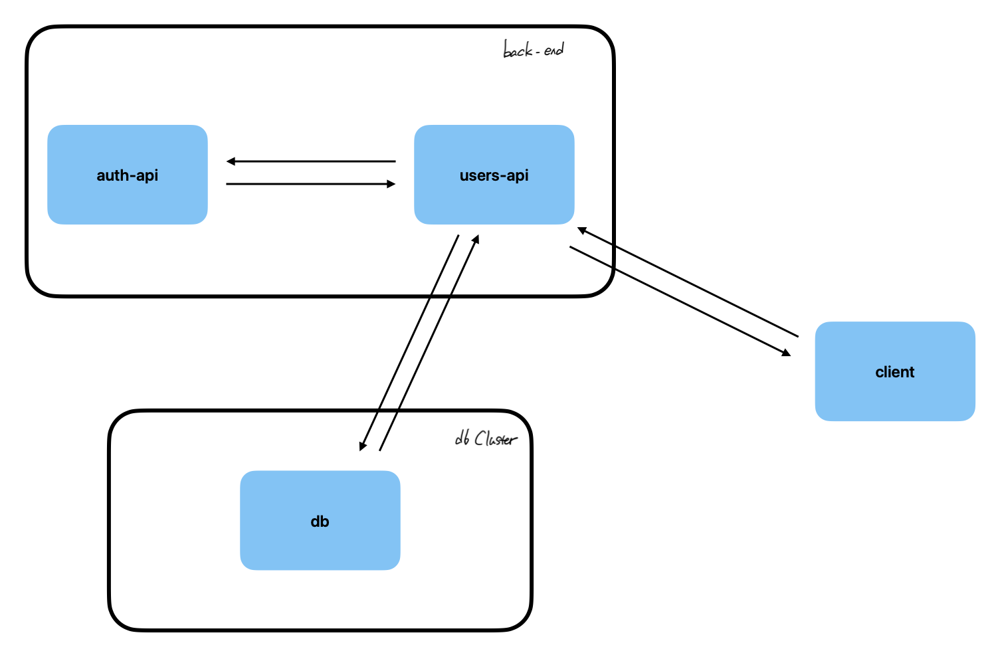
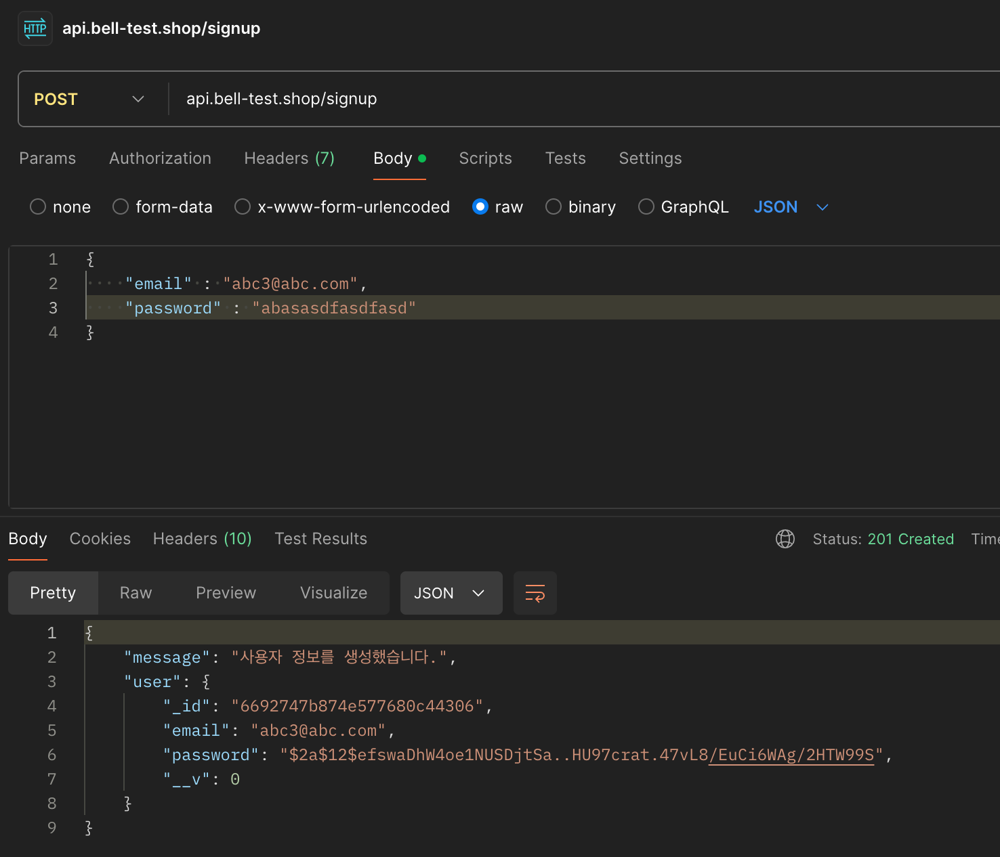
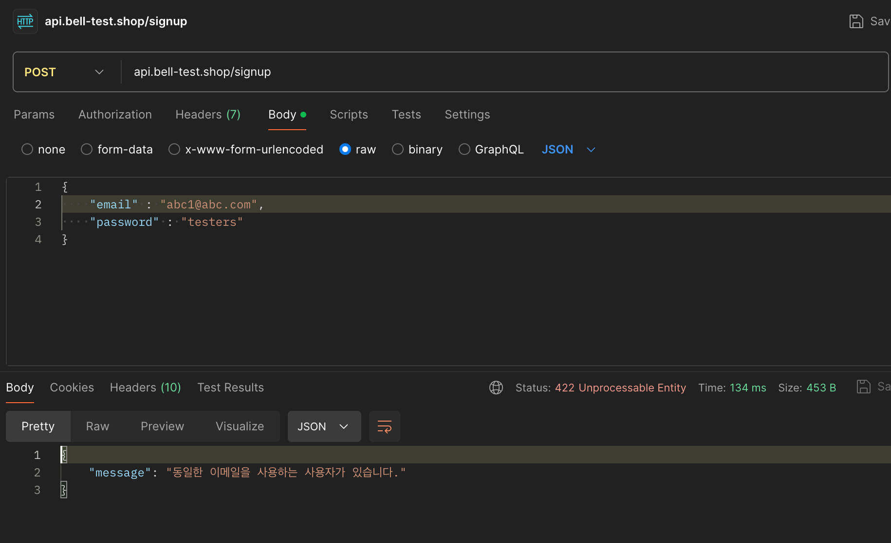
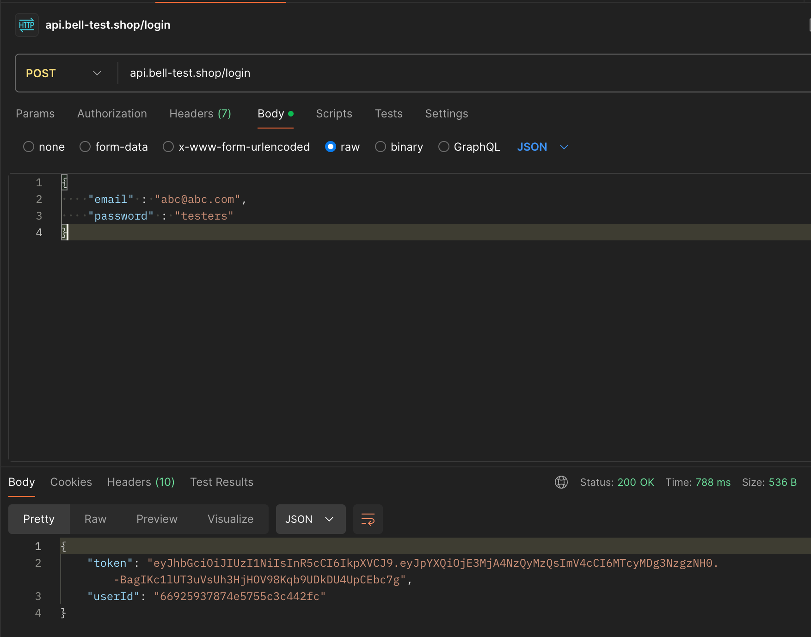
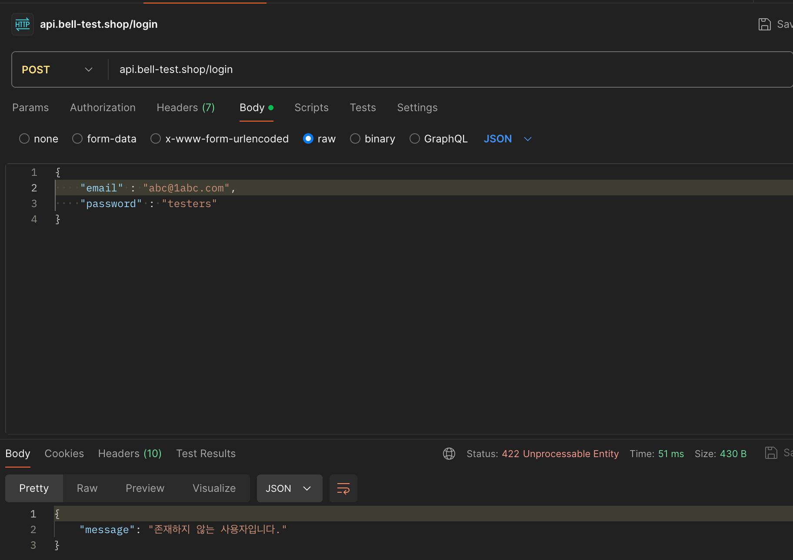
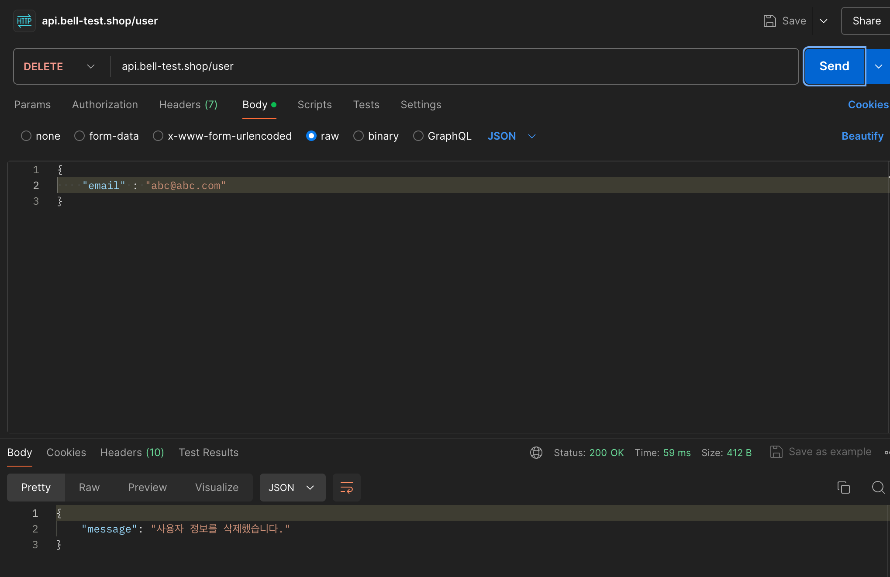
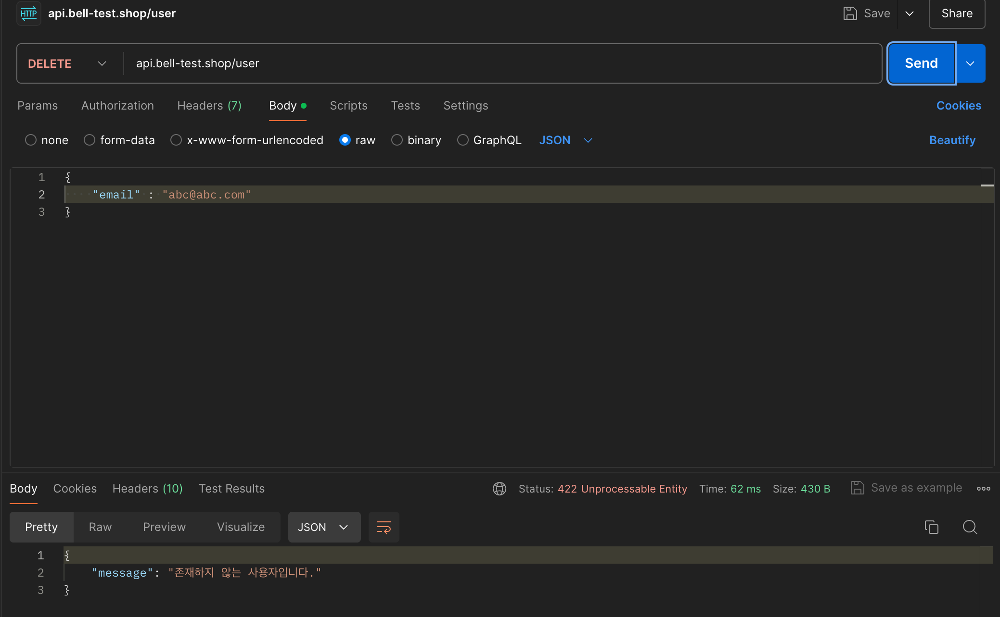

# 기확단계

### 필수 작업 사항

---

- [x] `API` 서버 구성
- [x] `DB`와의 기본 `CRUD` 구현


</br>
</br>

# 백엔드 환경

`Auth-api` 와 `Users-api`, 총 2개를 구성했습니다.

기술 스택의 경우 `Node.js+express` 를 활용했고, 이메일과 비밀번호를 기반으로 사용자 생성, 인증, 삭제 등을 설계했습니다.

> `Node.js+express` 를 고른 건, 사용해본 경험이 있는 스택을 통해 빠른 구현을 진행하기 위해서였습니다. 더불어 `Node.js` 는 최소한의 모듈만 가지고도 간단한 `CRUD` 구현이 가능하다는 장점이 있습니다.

## Users-api

`Users-api` 는 외부 요청을 수용하여, 전달되는 `이메일, 패스워드` 를 기반으로 사용자 생성, 인증, 삭제 등의 기능을 제공하는 서버 입니다.

기본적으로 외부에서 전달되는 모든 요청은 `Users-api` 가 받으며, 작업에 따라, `Auth-api` 에게 요청을 보내기도 합니다.

## Auth-api

`Auth-api` 는 서버 내부의 통신을 통해 `Users-api` 에 필요한 기능을 제공하는 `internal` 서버로, 해시 함수 기반의 비밀번호 암호화, 토큰 생성 등의 기능을 제공해주고 있습니다.

실제 `Client, Server, DB` 간의 통신 흐름을 살펴보면 다음과 같습니다.



## DB

`DB` 의 경우, `MongoDB`를 활용했습니다. `Mongoose+Express` 의 사례가 많고, 무료 `DB` 클러스터 서비스를 제공하기 때문에 로컬 환경에서도 외부와의 통신을 제어하고자 선택했습니다.

</br>
</br>

## 해결점

### github action + Helm 을 활용한 프로젝트 배포 설계

아쉽게도 수행하지 못했던 부분으로 실제 구현을 했다면 이런식으로 적용해보지 않았을까 합니다.

총 5단계의 과정을 진행합니다.

1. `commit, merge` 등 프로젝트 리포지토리의 업데이트를 기점으로 `github action` 을 실행합니다.

2. 현재 프로젝트 코드를 바탕으로 `Docker Iamge` 를 새롭게 생성하여 `Hub` 공간에 푸시합니다.

3. `Docker` 정보를 `secret` 공간에 저장하고, 이를 통해 이미지 정보를 불러옵니다.

4. `kubernets` 클러스터에 접근하기 위한 증명이 필요합니다. 크게 2가지를 고민했습니다.

   1. `./kube/config` 정보를 `secret` 항목으로 저장하고 이를 기반으로 접근합니다. -> 이부분의 경우, 클러스터가 재생성되면 작업이 진행되지 않을거라 판단됩니다.

   2. `AWS` 자격 증명을 활용합니다. -> 이부분의 경우, 클러스터가 변경되더라도 제어하는 것이 가능할 것이라 추측했습니다. (이름을 계속 동일하게 하거나, 최신 생성된 클러스터를 찾는 방식 등으로) 아마 실제 구현을 했다면 이쪽을 택했을 것입니다.

5. `Chart` 정보를 `secret` 공간에 저장하고, 이를 기반으로 `helm` 배포 명령어를 실행하도록 합니다.

</br>
</br>

## 작업 완료 사항 (첨부 사진 포함)

실제 배포가 이루어져 있는 상태에서 적용한 스크린샷 입니다. 취준생 입장에서 인프라 비용이 생각보다 커서, 서비스는 우선 닫아둘 예정입니다.
혹시 미리 서비스를 사용해보길 원하신다면, 미리 연락해주시면 바로 배포하여 서비스를 만나보실 수 있도록 작업하겠습니다.

### 사용자 회원가입

`이메일 및 비밀번호` 를 요청하여, 회원가입을 진행합니다.
작업 과정 중 `Auth-api` 와 통신을 하여 비밀번호의 암호화된 정보를 받습니다.

```typescript
POST users-api/singup
GET  auth-api/hashed-pw/:password
```

### 성공 시



### 실패 시(동일한 이메일이 있는 경우)



### 실패 시(유효성 검증 실패)


### 사용자 로그인

가입한 `이메일과 비밀번호` 를 통해, 로그인을 진행합니다.
작업 과정 중, `Auth-api` 와 통신을 하여 입력된 비밀번호와 저장된 암호화된 비밀번호가 동일한지 확인한 후 토큰을 제공받습니다.

```typescript
POST users-api/login
POST auth-api/token
```

### 성공 시



### 실패 시



### 사용자 삭제

가입한 `이메일` 을 통해, 삭제를 진행합니다.

```typescript
DELETE users-api/user
```

### 성공 시



### 실패 시



## 프로젝트 구조

```
📦
├─ auth-api
│  ├─ .dockerignore
│  ├─ Dockerfile
│  ├─ auth-app.js
│  ├─ controllers
│  │  └─ auth-actions.js
│  ├─ helpers
│  │  └─ error.js
│  ├─ package.json
│  └─ routes
│     └─ auth-routes.js
└─ users-api
   ├─ .dockerignore
   ├─ Dockerfile
   ├─ controllers
   │  └─ user-actions.js
   ├─ helpers
   │  └─ error.js
   ├─ models
   │  └─ user.js
   ├─ package.json
   ├─ routes
   │  └─ user-routes.js
   └─ users-app.js
```

©generated by [Project Tree Generator](https://woochanleee.github.io/project-tree-generator)
